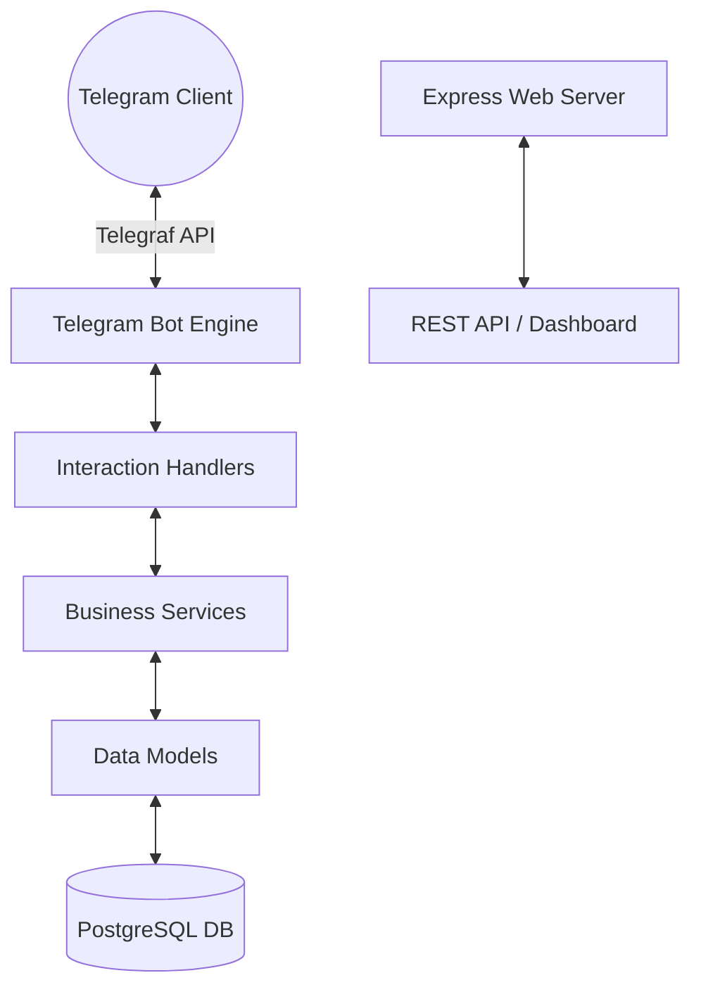

# Smart-Stock Inventory Bot Project Presentation

This document contains a slide presentation designed to showcase the Smart-Stock Inventory Bot system to stakeholders, course instructors, or developers.

````carousel
# 📦 Smart-Stock Inventory Bot
### Next-Gen Conversational Inventory Management System

**Course:** Software Project Development (2026)  
**Live Bot:** [@SmartStockInventoryBot](https://t.me/SmartStockInventoryBot)  
**Target User:** Wholesale Shop Owners & Sellers in Orussey Market

---

*A full-stack, modular solution connecting a conversational Telegram interface, a responsive web management dashboard, and a secure PostgreSQL database.*

<!-- slide -->
# ❓ Problem & Solution

### ⚠️ The Problem in Orussey Market
* **Complex Cataloging:** Manual pen-and-paper tracking of colors, sizes, and stock.
* **Loss of Sales:** Lack of real-time low stock warnings.
* **High Barrier to Entry:** Complex ERP software is hard for shopkeepers to learn.

### 💡 The Smart-Stock Solution
* **Conversational Interface:** Shop staff manage stock via a simple Telegram chat.
* **Persistent Button Menu:** One-click shortcuts for viewing records.
* **Web Sync:** Automatically updates a responsive dashboard.

<!-- slide -->
# 🛠️ Technology Stack

| Layer | Technology | Purpose |
| :--- | :--- | :--- |
| **Backend Core** | Node.js / Express | API Routes, Webhook, and Server Runtime |
| **Interface** | Telegraf / Telegram | Conversational User Interface |
| **Database** | PostgreSQL (Neon) | Secure, Relational Data Persistence |
| **Media Host** | Cloudinary | Cloud-based Product Image Storage |
| **Testing Suite** | Mock & Assert Rig | High-Coverage Technical Staging Audit |

<!-- slide -->
# 🏗️ Architecture Design



<!-- slide -->
# ✨ Key Project Features

### 🤖 Conversational Interface & UX
* **Product Wizard:** Step-by-step item creation (`/add_product`) with `/skip` and validation.
* **Persistent Bottom Menu:** Standard reply buttons for easy navigation (Menu, Catalog, History, Profile).

### 📦 Catalog & Stock Management
* **Catalog Pagination:** Displays 5 products per page with `◀️ Prev` / `Next ▶️` navigation.
* **Stock Controls:** Barcode lookups (`/check_stock`) and adjustments (`/update_stock`).

### 💰 Transactions & Auditing
* **Sales Recording:** Auto-deducts inventory levels on sale checkout (`/sell`).
* **Audits & Reports:** Role-specific history logs, global audit logs, and currency exchange rates (`/exchange`).

### 👤 Management & Security
* **User Management:** Promotion and ban/unban dashboard (`/manage_users`).
* **Zero-Crash Security:** Input sanitization and error fallback shields.

<!-- slide -->
# 📄 Feature: Catalog Pagination

```
📖 Live Product Catalog (Page 1/3)
Updated from database: 6/27/2026

📦 Cotton T-Shirt
├── Barcode: 885101 (6 characters)
└── Stock: 41 units (active)
--------------------------------------
[ ◀️ Prev ] [ Next ▶️ ]
```

* **Clean Presentation:** Limits display to **5 products per page** to prevent screen clutter.
* **Dynamic Buttons:** Inline `◀️ Prev` and `Next ▶️` buttons show up automatically when pages exceed 1.

<!-- slide -->
# 🛡️ Resilience & Testing Rigor

### 🔒 Zero-Crash Design
* Handled with global `bot.catch()` middleware to keep the bot running during network or API errors.
* Input validation blocks sql injections and malformed inputs.

### 🧪 Staging Audit Test Coverage
* **Unit Tests:** Formatter logic and DB adapter lookups.
* **Integration Tests:** Access restrictions and banned user validation.
* **End-to-End Tests:** Complete multi-step wizard state machine walks and rollbacks.

<!-- slide -->
# 🏁 Project Summary

### 🎯 Project Impact
* **Target Achieved:** Delivered a robust conversational inventory system for Orussey Market.
* **Enterprise Features:** Integrates Telegram client, Express web admin dashboard, Neon DB, and Cloudinary.

### 🚀 Production-Ready Rigor
* **Zero-Crash Shields:** Input validations and global fallback blocks.
* **High Coverage:** Solid test matrix covering unit, integration, and E2E checks.

### 🔮 Future Roadmap
* Add multi-language support (Khmer translation).
* Implement Redis/DB session states for the wizard.
* Real-time automated low-stock notifications.

<!-- slide -->
# 🏁 Conclusion

### 💡 Conversational Empowerment
* **Low Barrier, High Value:** Successfully simplified inventory management for traditional Orussey Market sellers using an intuitive Telegram interface.
* **Accuracy & Control:** Replaced manual notebook logs with strict schema rules and automated calculations.

### 🌟 Technical Synergy
* **Real-time Sync:** Seamless data sync between mobile staff (Telegram Bot) and back-office management (Express Web Dashboard).
* **Audit Compliance:** Zero-crash architecture backed by a comprehensive unit, integration, and E2E test matrix.

### 🔮 The Future Vision
* **Accessible Tech:** Smart-Stock proves that automation does not require expensive devices or complex training—just a secure chat window.
````
